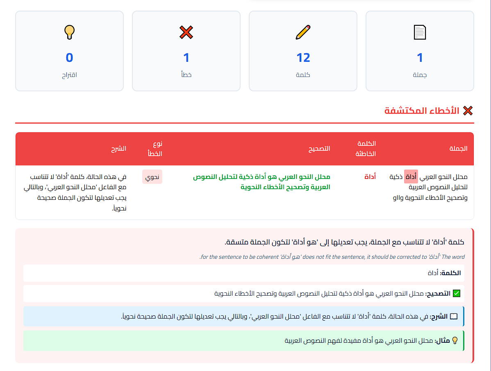

# محلل النحو العربي 📝
# Arabic Grammar Analyzer

أداة ذكية لتحليل النصوص العربية وتصحيح الأخطاء النحوية والإملائية للطلاب والمعلمين.

AI-powered Arabic grammar checker for students and teachers.



---

## 🚀 البدء السريع | Quick Start

### المتطلبات | Requirements
- Python 3.8+

### التثبيت | Installation

```bash
# إنشاء بيئة افتراضية | Create virtual environment
python -m venv venv

# تفعيل البيئة الافتراضية | Activate virtual environment
# Windows:
venv\Scripts\activate
# macOS/Linux:
source venv/bin/activate

# تثبيت المتطلبات | Install dependencies
pip install -r requirements.txt
```

### إعداد مفتاح API | API Key Setup

أنشئ ملف `.env` وأضف مفتاح OpenAI:

Create a `.env` file and add your OpenAI key:

```
OPENAI_API_KEY=your-api-key-here
```

### تشغيل التطبيق | Run the App

```bash
python app.py
```

### فتح المتصفح | Open Browser

```
http://127.0.0.1:5000
```

---

## 📝 مثال للتجربة | Test Example

```
الطالب المجتهد ينجح في الامتحان. المعلم يشرح الدرس بوضوح.
```

---

## ✨ المميزات | Features

| العربية | English |
|---------|---------|
| تحليل نحوي بالذكاء الاصطناعي | AI-powered grammar analysis |
| اكتشاف الأخطاء مع التصحيح | Error detection with corrections |
| شرح مفصل لكل خطأ | Detailed explanations for each error |
| جدول تحليل نحوي | Grammar analysis table |
| واجهة عربية سهلة | Arabic-first easy interface |

---

## 🛠️ التقنيات | Tech Stack

| العربية | English |
|---------|---------|
| **الخادم:** بايثون، فلاسك، OpenAI API | **Backend:** Python, Flask, OpenAI API |
| **الواجهة:** HTML, CSS, JavaScript | **Frontend:** HTML, CSS, JavaScript |

---

**صُنع بـ ❤️ بواسطة سلطان الوليعي**

**Made with ❤️ by Sultan Alwaliei**
